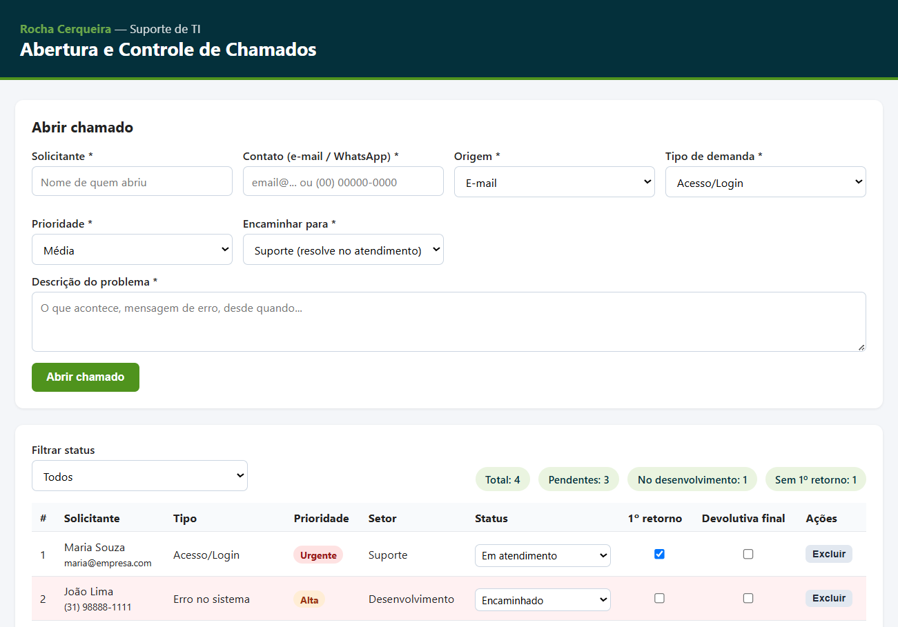
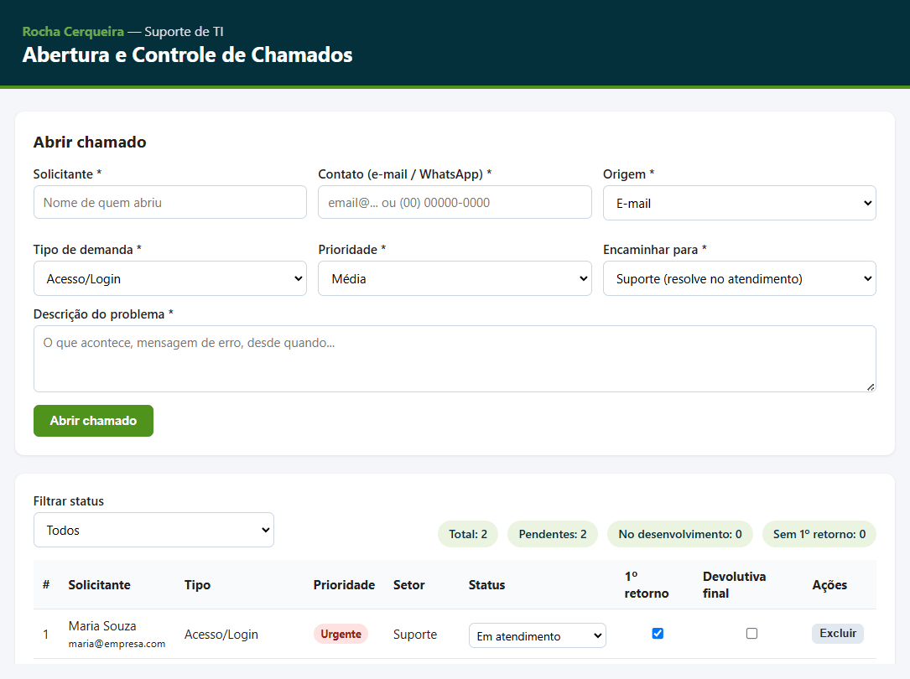

<div align="center">

# 🧩 Prova — Processo Seletivo: Estágio em TI

**Atendimento de suporte · Sistema de chamados · Integração com API**

Entrega no **formato Opção B** (totalmente via GitHub) — respostas teóricas neste README e código nas pastas do repositório.

<br>


<br>

📋 [Questão 1](#questão-1--atendimento-de-suporte-e-triagem) ·
🛠️ [Questão 2](#questão-2--solução-de-abertura-e-controle-de-chamados) ·
🔌 [Questão 3](#questão-3--lógica-de-programação-e-integração-api) ·
🤖 [Uso de IA](#declaração-de-uso-de-ia)

**Candidato:** Paollo Sanchez Pinheiro &nbsp;·&nbsp; **WhatsApp:** (31) 99641-4518

</div>

---

## Questão 1 — Atendimento de suporte e triagem

> Usuário: *"Não consigo acessar o sistema. Coloco e-mail e senha, mas aparece uma mensagem de erro. Preciso acessar ainda hoje porque tenho uma entrega interna com prazo."*

### Postura inicial
Reconhecer o prazo, tranquilizar e já sinalizar que vou conduzir com organização.
Mensagem inicial enviada ao usuário:

> "Bom dia! Entendi a urgência por causa da sua entrega de hoje — vou te ajudar.
> Para agilizar, preciso de algumas informações rápidas abaixo. Já registrei seu
> chamado e te dou um primeiro retorno em instantes."

### Perguntas que faria ao usuário
1. Qual o **e-mail/usuário** exato que está usando para entrar?
2. Qual é a **mensagem de erro** exibida (texto exato)?
3. Quando **começou** e se já funcionou antes hoje/ontem.
4. Está acontecendo só com você ou com **colegas** também?
5. Qual **navegador/dispositivo** e se está na **rede da empresa** ou externa/VPN.
6. Recentemente **trocou a senha**, expirou ou alterou algo na conta?

### Evidências que solicitaria
- **Print/foto da tela inteira** com a mensagem de erro visível.
- Horário aproximado da tentativa.
- (Se possível) confirmação se a URL do sistema está correta.

### Verificações simples antes de encaminhar
- Confirmar se o **e-mail está digitado corretamente** (espaços, domínio).
- Pedir para testar em **aba anônima** ou outro navegador (descarta cache/cookie).
- Verificar **Caps Lock / teclado** e tentar **redefinir a senha** pelo "Esqueci minha senha".
- Checar se o **sistema está no ar** (outros usuários conseguem acessar?) — distingue problema individual de queda geral.
- Conferir se a conta não está **bloqueada/inativa/expirada**.

### Classificação de prioridade
Como há **prazo de entrega no mesmo dia** e o usuário está **totalmente bloqueado**
(não consegue trabalhar), classifico como **Alta / Urgente**. Se fosse uma dúvida
sem impacto imediato, seria Média ou Baixa.

### Registro da demanda
Registraria em planilha/sistema de chamados com, no mínimo:
`Nº | Data/Hora | Solicitante | Contato | Origem | Tipo (Acesso/Login) |
Descrição | Prioridade | Status | 1º retorno | Encaminhado para | Devolutiva final`.
(Exatamente os campos do protótipo da Questão 2.)

### Quando resolveria diretamente
- Erro de digitação de e-mail/senha, Caps Lock.
- Senha expirada → orientar redefinição.
- Cache/navegador → aba anônima resolve.
- Conta apenas precisando de reativação simples dentro da minha alçada.

### Quando encaminharia ao desenvolvedor
- Mensagem de erro **técnica/sistêmica** (ex.: erro 500, falha de banco, tela branca).
- O problema **acontece com vários usuários** ao mesmo tempo (possível queda/bug).
- Login correto, conta ativa, e ainda assim o sistema recusa — indício de falha na aplicação.

### Quando encaminharia a outro setor
- **Atendimento/Implantação:** cadastro do usuário incompleto ou perfil/permissão não liberado.
- **Administrativo/RH:** colaborador desligado ou acesso que não deveria existir.
- **Financeiro / responsável pelo contrato:** acesso bloqueado por **inadimplência** ou contrato suspenso — não é falha técnica, é regra de negócio.

### Informações que enviaria ao desenvolvedor (ao escalar)
- Usuário/e-mail afetado e ambiente (produção/homologação).
- Mensagem de erro exata + print.
- Passo a passo para reproduzir, data/hora, navegador/dispositivo.
- Abrangência (1 usuário ou vários) e o que já testei.
- Prioridade e o prazo do usuário.

### Garantir que só finalize após devolutiva final
- O chamado **só muda para "Encerrado" depois de confirmar a solução com o usuário**.
- No protótipo (Questão 2) isso é uma **trava**: o sistema **impede o encerramento**
  enquanto a caixa **"devolutiva final"** não estiver marcada.
- Sempre fecho com uma confirmação: *"Conseguiu acessar? Posso encerrar o chamado?"*

---

## Questão 2 — Solução de abertura e controle de chamados

**Formato escolhido:** tela funcional em **HTML, CSS e JavaScript** → pasta [`questao-2/`](questao-2).
A identidade visual (cores e marca) segue o tema da [Rocha Cerqueira](https://rochacerqueira.com.br/).

🔗 **Teste ao vivo (sem baixar nada):** https://paollosc.github.io/prova-estagio-ti/questao-2/



**Regra principal — não encerrar sem devolutiva ao solicitante.** Ao tentar mudar o
status para *Encerrado* sem marcar a "devolutiva final", o sistema bloqueia e avisa;
só após marcá-la o encerramento é permitido:



### Como rodar
Acesse o link ao vivo acima, ou abra o arquivo [`questao-2/index.html`](questao-2/index.html)
localmente no navegador (duplo clique). Não precisa de servidor nem instalação.
Os chamados ficam salvos no `localStorage` do navegador.

### Campos do formulário
Solicitante, Contato (e-mail/WhatsApp), Origem (E-mail/WhatsApp/Telefone/Presencial),
Tipo de demanda, Prioridade, Setor de encaminhamento e Descrição.

### Informações obrigatórias para abertura
Solicitante, Contato, Origem, Tipo, Prioridade, Setor e Descrição — todos marcados
como `required`; sem eles o chamado não é aberto.

### Status que a demanda pode assumir
`Aberto` → `Em atendimento` → `Aguardando solicitante` → `Encaminhado` → `Resolvido` → `Encerrado`.

### Como separo resolvido / desenvolvimento / outro setor
Pelo campo **Setor**: "Suporte" (resolvido no atendimento), "Desenvolvimento" ou
um setor de negócio (Atendimento, Implantação, Administrativo, Financeiro). Ao abrir,
quem vai para Suporte entra como *Em atendimento*; os demais entram como *Encaminhado*.
Os indicadores no topo mostram, por exemplo, "No desenvolvimento: X".

### Como registro prioridade
Campo **Prioridade** (Baixa/Média/Alta/Urgente), exibido como etiqueta colorida
na tabela para leitura rápida.

### Como sinalizo pendências e prazo
Linhas **Alta/Urgente** ainda sem primeiro retorno e não resolvidas são **destacadas
em vermelho** (regra de "fora do prazo"). O indicador "Pendentes" conta tudo que não
está Resolvido/Encerrado.

### Primeiro retorno e devolutiva final
Duas caixas de marcação por chamado: **"1º retorno"** e **"devolutiva final"**,
controlando o início e o fim do atendimento.

### Como impeço encerrar sem retorno ao solicitante
Trava no código: ao tentar mudar o status para **"Encerrado"** sem a **"devolutiva
final"** marcada, o sistema **bloqueia e avisa**. (ver `mudarStatus()` em
[`questao-2/script.js`](questao-2/script.js)).

### Tecnologias utilizadas
HTML5, CSS3 e JavaScript puro (sem frameworks). Persistência via `localStorage`.

### Como testaria
1. Abrir um chamado com cada prioridade e conferir destaque/etiquetas.
2. Tentar encerrar sem a devolutiva final → deve bloquear.
3. Marcar a devolutiva e encerrar → deve permitir.
4. Filtrar por status e conferir os indicadores.
5. Recarregar a página → os dados continuam (localStorage).

### Melhorias para uma 2ª versão
- Back-end real (banco de dados) para acesso compartilhado entre a equipe.
- Autenticação e histórico/comentários por chamado.
- Notificação automática por e-mail/WhatsApp no primeiro retorno e na devolutiva.
- SLA por prioridade e dashboard de BI (liga direto com a Questão 5).
- Exportação para CSV/Excel.

---

## Questão 3 — Lógica de programação e integração (API)

**Linguagem:** Python 3 (apenas biblioteca padrão — sem dependências).
**Arquivo:** [`questao-3/usuario_mais_sobrecarregado.py`](questao-3/usuario_mais_sobrecarregado.py)

### O que o script faz
1. Consome `https://jsonplaceholder.typicode.com/users` e `/todos`.
2. Conta as tarefas **pendentes** (`completed: false`) por `userId`.
3. Cruza o `userId` com o nome do usuário e imprime quem tem **mais pendências**.

### Como rodar
```bash
cd questao-3
python usuario_mais_sobrecarregado.py
```

### Saída
```
Usuário mais sobrecarregado:
  Nome: Patricia Lebsack
  Tarefas pendentes: 14
```

### Teste
Há um teste offline da lógica (não acessa a rede):
```bash
python test_logica.py   # -> OK: logica validada.
```

### Decisões de implementação
- Usei `urllib` da biblioteca padrão (em vez de `requests`) para o script rodar em
  **qualquer máquina sem instalar nada**.
- `collections.Counter` resolve a contagem por usuário de forma limpa.
- Separei a lógica (`usuario_mais_sobrecarregado`) do acesso à rede, o que permite
  **testar sem internet**.

---

## Declaração de uso de IA

Conforme as orientações da prova:

- **Ferramenta utilizada:** Claude (assistente de IA), como apoio à escrita e revisão.
- **Finalidade:** estruturar as respostas teóricas, organizar o protótipo da Questão 2
  e revisar a lógica da Questão 3.
- **Prompts/instruções fornecidos:** pedi para responder à prova seguindo exatamente
  os itens solicitados em cada questão e criar um repositório organizado no GitHub.
- **Ajustes manuais / decisões próprias:** escolhi as questões respondidas (1, 2 e 3),
  a stack do protótipo (HTML/CSS/JS puro), a linguagem da Questão 3 (Python) e a
  regra de negócio central (não encerrar chamado sem devolutiva final).
- **Como validei:** **executei** o script da Questão 3 contra a API real (resultado
  confirmado: Patricia Lebsack, 14 pendentes) e rodei o teste offline; **abri e testei**
  a tela da Questão 2 no navegador.
- **Segurança e privacidade:** não inseri dados reais, sigilosos ou pessoais de
  terceiros. Foram usados apenas dados públicos de teste (JSONPlaceholder) e exemplos
  fictícios. Em um cenário real, evitaria enviar a uma IA dados sensíveis de usuários
  (e-mails reais, senhas, informações de contrato/financeiras).
